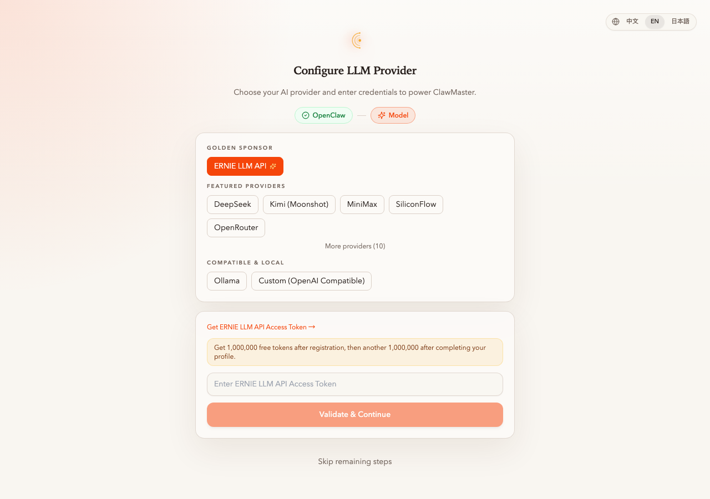
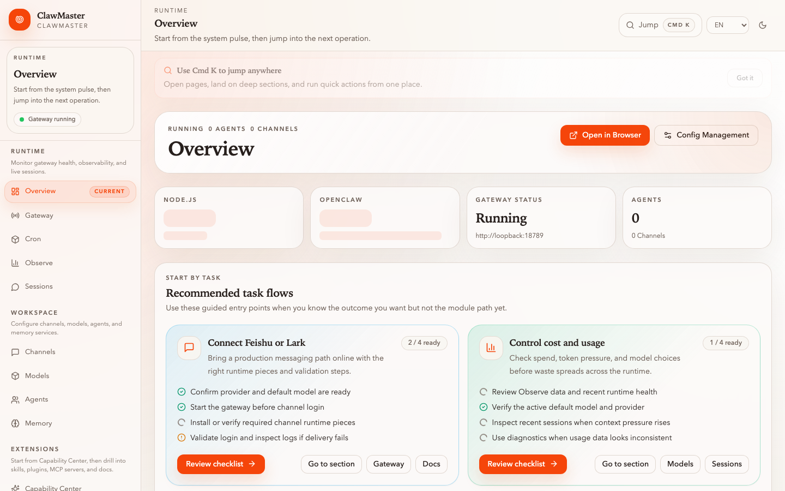
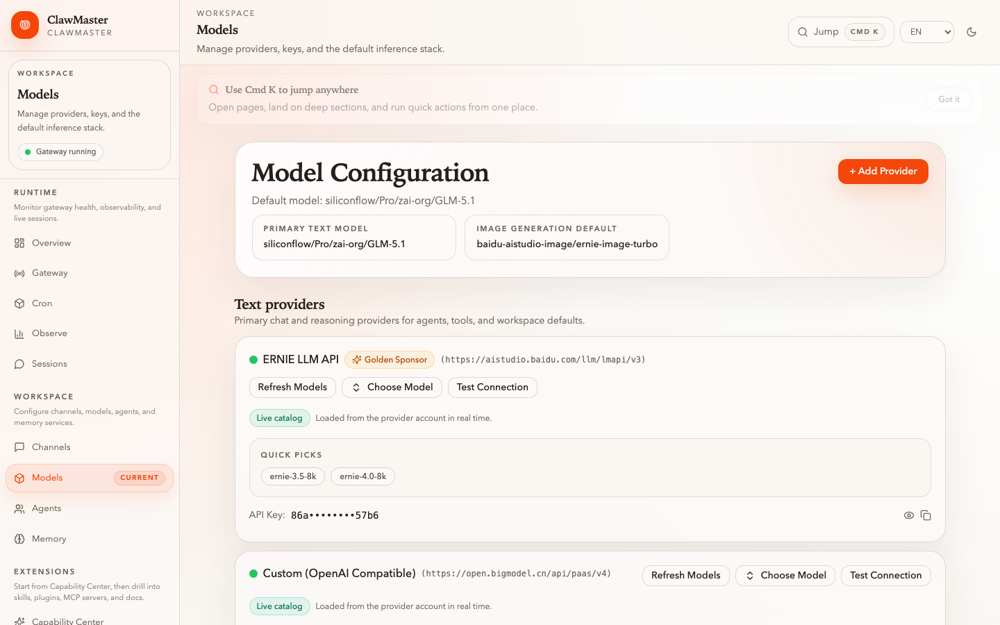
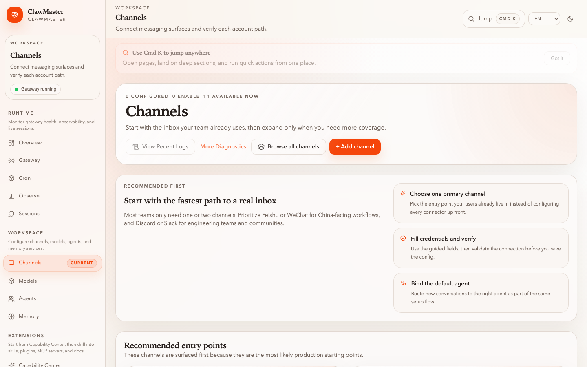
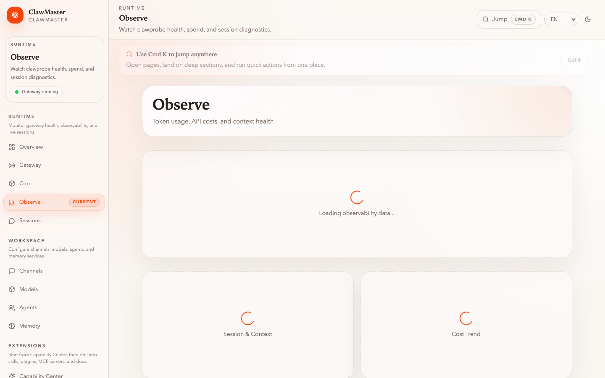
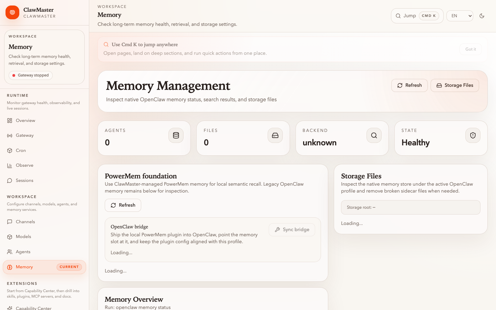
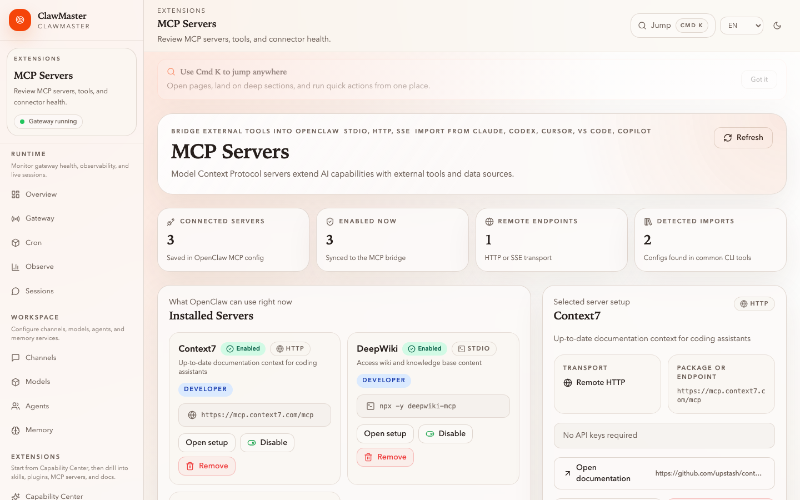
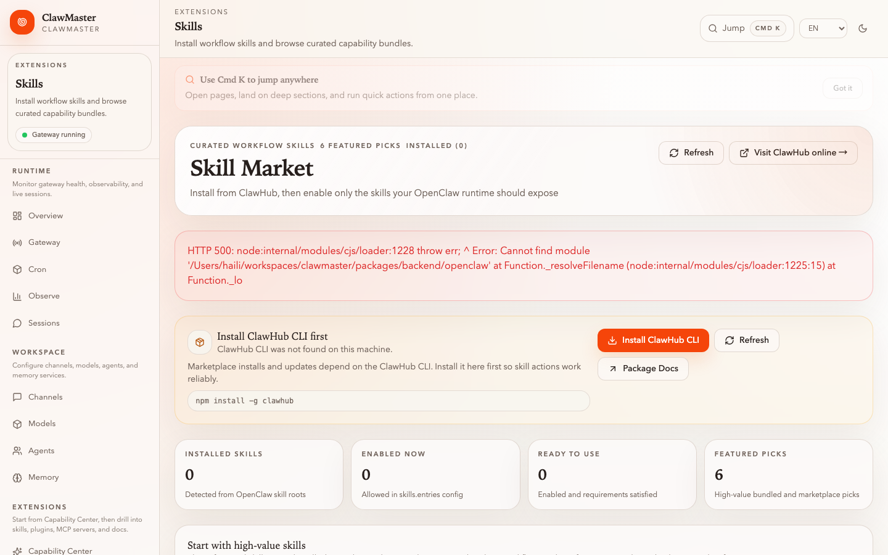

<p align="center">
  <picture>
    <source media="(prefers-color-scheme: dark)" srcset="https://raw.githubusercontent.com/openmaster-ai/brand/main/logos/clawmaster/wordmarks/dark/horizontal.png" />
    
  </picture>
</p>

<p align="center">
  
  
  
  
</p>

<p align="center">
  
  &nbsp;
  
  
  <a href="https://github.com/openmaster-ai/clawmaster-workshop"></a>
</p>

<p align="center">
  <a href="#quick-start"></a>
  <a href="#roadmap"></a>
  <a href="./CONTRIBUTING.md"></a>
</p>

<p align="center">
  <a href="https://github.com/openmaster-ai/clawmaster/actions/workflows/build.yml"></a>
  <a href="https://github.com/openmaster-ai/clawmaster/milestone/1"></a>
  <a href="https://github.com/openmaster-ai/clawmaster/stargazers"></a>
  
</p>

<p align="center">
  <a href="https://github.com/openmaster-ai/clawmaster/releases"><strong>📦 Releases</strong></a> &nbsp;·&nbsp;
  <a href="https://github.com/openmaster-ai/clawmaster/discussions"><strong>💬 Discussions</strong></a> &nbsp;·&nbsp;
  <a href="https://github.com/openmaster-ai/clawmaster/issues"><strong>🐛 Issues</strong></a> &nbsp;·&nbsp;
  <a href="https://deepwiki.com/openmaster-ai/clawmaster"><strong>📘 Ask DeepWiki</strong></a>
  &nbsp;&nbsp;|&nbsp;&nbsp;
  English &nbsp;·&nbsp; <a href="./README_CN.md">中文</a> &nbsp;·&nbsp; <a href="./README_JP.md">日本語</a>
</p>

## Quick Start

### CLI + Web Console (recommended)

```bash
npm i -g clawmaster
clawmaster                   # start the web console
```

Open http://localhost:16223 — the setup wizard walks you through OpenClaw engine detection and LLM provider configuration. No config files to edit.

```bash
clawmaster serve --daemon    # run in background
clawmaster stop              # stop the service
clawmaster doctor            # verify your environment
```

> [!NOTE]
> The current release is **v0.3.1**. The next milestone is [**v0.4.0**](https://github.com/openmaster-ai/clawmaster/milestone/1) — already shipping features land there as they merge.

### Desktop App (Beta)

Download the installer for your platform from [GitHub Releases](https://github.com/openmaster-ai/clawmaster/releases):

| Platform | Format |
|---|---|
| macOS Apple Silicon | `.dmg` |
| macOS Intel | `.dmg` |
| Windows x64 | `.msi`, `.exe` |
| Linux x64 | `.deb`, `.AppImage` |

> [!WARNING]
> Desktop builds are in **beta**. The CLI + Web Console is the recommended and most thoroughly tested install method.

<details>
<summary>From source</summary>

```bash
git clone https://github.com/openmaster-ai/clawmaster.git
cd clawmaster
npm install
npm run dev:web              # web console + backend
npm run tauri:dev            # desktop app
```

Requires Node.js 20+. Tauri desktop builds also need Rust — see [tauri.app/start/prerequisites](https://tauri.app/start/prerequisites/).

</details>

### After Launch

1. Pick an existing OpenClaw profile or create a new one.
2. Connect at least one model provider and set a default model.
3. Add channels, plugins, skills, or MCP servers as needed.
4. Enable gateway or observability when you need runtime inspection.

### Pick your learning path

- 🧪 **Hands-on** — run through [**clawmaster-workshop**](https://github.com/openmaster-ai/clawmaster-workshop) — trilingual (EN / 中文 / 日本語) tasks grouped by the six core capabilities, plus dated labs that chain tasks into real scenarios. Best if you want to *do* the thing.
- 🖼️ **Pictured walkthrough** — skim the [Product Tour](#product-tour) below. Each screenshot maps to a concrete task, so you can understand what the product does without installing anything.

## Why ClawMaster

Most OpenClaw tooling stops at configuration. ClawMaster is your **OpenClaw companion for real life** — a bridge between OpenClaw's power and everyday usability. It's for people who want OpenClaw to actually work in their daily life (not just be correctly configured), who don't want to live in JSON and terminals, and who manage OpenClaw for a team or family.

## Memory Highlights

Memory is the backbone of the **Save** capability. We build on [**PowerMem**](https://github.com/oceanbase/powermem) ([Python](https://github.com/oceanbase/powermem) · [TypeScript SDK](https://github.com/ob-labs/powermem-ts) · [OpenClaw plugin](https://github.com/ob-labs/memory-powermem)) instead of rolling our own:

- **Native OpenClaw citizen** — PowerMem already ships an OpenClaw memory plugin, so agent turns get auto-recall / auto-capture for free.
- **Smart extraction, not chunk dumping** — distills conversations into durable facts with Ebbinghaus-style decay and recall, which matches our "build but also maintain" direction.
- **Multi-agent isolation built in** — scopes per user / agent / workspace without us reinventing identity plumbing.
- **Database-grade durability** — pairs with [OceanBase seekdb](https://github.com/oceanbase/seekdb) for hybrid vector + full-text + SQL, with SQLite as a cross-platform fallback.
- **Open source with cross-language SDKs** — we're not locked into one runtime; consistent semantics from JS to Python to Go.

**Shipped**

- Managed PowerMem runtime with an OpenClaw bridge across web, backend, and desktop — agent turns get auto-recall and auto-capture out of the box.
- Local workspace import that pulls markdown / `memory/` into managed PowerMem, using seekdb where available and SQLite as a fallback.
- First end-to-end memory-backed skill: a daily package download digest with period-over-period deltas.
- Memory-adjacent observability — per-session spend, scheduled cost digests, and models.dev pricing.

**Next (v0.4.0)**: full seekdb hybrid retrieval and a self-maintaining LLM Wiki module — persistent wiki pages that compound with every ingest, with Ebbinghaus decay and freshness-weighted ranking keeping content alive. See the [v0.4.0 milestone](https://github.com/openmaster-ai/clawmaster/milestone/1) for tracked work.

## Product Tour

<table>
  <tr>
    <td align="center" width="25%">
      <a href="./docs/screenshots/wizard-provider.png"></a><br/>
      <sub><b>Setup wizard</b> · 2-step guided install, tiered providers</sub>
    </td>
    <td align="center" width="25%">
      <a href="./docs/screenshots/page-dashboard.png"></a><br/>
      <sub><b>Overview</b> · Runtime health, next-step task flows</sub>
    </td>
    <td align="center" width="25%">
      <a href="./docs/screenshots/page-models.png"></a><br/>
      <sub><b>Models</b> · Multi-provider config with live key validation</sub>
    </td>
    <td align="center" width="25%">
      <a href="./docs/screenshots/page-channels.png"></a><br/>
      <sub><b>Channels</b> · Guided onboarding for 6 messaging platforms</sub>
    </td>
  </tr>
  <tr>
    <td align="center">
      <a href="./docs/screenshots/page-observe.png"></a><br/>
      <sub><b>Observe</b> · ClawProbe-backed cost, tokens, session health</sub>
    </td>
    <td align="center">
      <a href="./docs/screenshots/page-memory.png"></a><br/>
      <sub><b>Memory</b> · PowerMem runtime with seekdb / SQLite fallback</sub>
    </td>
    <td align="center">
      <a href="./docs/screenshots/page-mcp.png"></a><br/>
      <sub><b>MCP</b> · Servers, endpoints, and skill definitions</sub>
    </td>
    <td align="center">
      <a href="./docs/screenshots/page-skills.png"></a><br/>
      <sub><b>Skills</b> · ClawHub marketplace with install and audit</sub>
    </td>
  </tr>
</table>

## Who It Is For

- **"I want OpenClaw useful in real life, not just configured."** — closes the gap between install and outcome.
- **"I'm non-technical but want a powerful AI assistant."** — guided setup, guided usage, no JSON required.
- **"I manage OpenClaw for my team or family."** — one place for channels, runtime state, and onboarding.
- **"I'm building advanced agent workflows."** — provider management, observability, memory, sessions, plugins, skills, and MCP in one place.

## Roadmap

Six core capabilities — each moves from infrastructure toward real daily use:

| # | Capability | Status | What's here | What's next |
|---|---|---|---|---|
| 1 | **Setup** | Available | Guided wizard, 6+ LLM providers with key validation, 6 channel types (Feishu / WeChat / Discord / Slack / Telegram / WhatsApp), profile switching | One-click environment migration ([#1](https://github.com/openmaster-ai/clawmaster/issues/1)), Windows + WSL2 first-class support |
| 2 | **Observe** | Available | ClawProbe-backed dashboard, per-session cost and token tracking, gateway health monitoring | Historical spend analytics, anomaly alerts, multi-profile comparison |
| 3 | **Save** | In progress | Managed PowerMem runtime + OpenClaw bridge, local workspace import, first memory-backed skill — see [Memory Highlights](#memory-highlights) | Full seekdb hybrid retrieval, self-maintaining LLM Wiki — see [v0.4.0 milestone](https://github.com/openmaster-ai/clawmaster/milestone/1) |
| 4 | **Apply** | In progress | PaddleOCR pipeline (upload → parse → structured markdown), layout-aware extraction | Photo → flashcard automation, invoice extraction templates, more scenario-first guided workflows |
| 5 | **Build** | Planned | Plugin/skill install and toggle, MCP server management, skill security auditing | Visual agent composer for skill chaining, LangChain Deep Agents integration, conversational agent builder |
| 6 | **Guard** | Planned | Skill Guard security scanning (dimension/severity/risk scoring), basic capability gating | API key vault (encrypted at rest), per-profile spend caps, RBAC for team deployments |

Browse [`label:roadmap`](https://github.com/openmaster-ai/clawmaster/issues?q=label%3Aroadmap) to pick up an item. Leave a comment before starting so work does not overlap.

## Versioning

ClawMaster follows [Pride Versioning](https://pridever.org/) — `PROUD.DEFAULT.SHAME`:

| Segment | When to bump |
|---|---|
| **Proud** | A release you are genuinely proud of |
| **Default** | Normal, solid releases |
| **Shame** | Fixing something too embarrassing to talk about |

Pre-release tags (`-rc.N`) are used for release candidates.

## 📰 News

- **2026-04-25** 🚀 v0.3.0 — first official release. Setup wizard, PaddleOCR, ERNIE image, cost observability, cron management, bundled skills refresh, and managed PowerMem support. CLI is the recommended install method; desktop builds remain beta.
- **2026-04-17** ✨ Brand and positioning launch — ClawMaster is now an OpenClaw companion for real life, not just a control plane. New wordmark, Apache 2.0 license, Pride Versioning.

## Development

```bash
npm install
npm run dev:web       # frontend + backend
npm run dev           # frontend only (port 16223)
npm run dev:backend   # backend only (port 16224)
npm run tauri:dev     # desktop app
```

<details>
<summary>Testing and CI</summary>

```bash
npm test              # unit tests (Vitest)
npm run build         # type check + production build
npm run test:desktop  # desktop smoke (macOS: real Tauri build; Linux/Win: WebDriver)
```

> [!TIP]
> Run `npm test && npm run build` before opening a PR — the same steps run in CI.

CI covers core checks including TypeScript, unit tests, and desktop/web build validation.

- [Test Suite](https://github.com/openmaster-ai/clawmaster/actions/workflows/test.yml)
- [Desktop Bundles](https://github.com/openmaster-ai/clawmaster/actions/workflows/build.yml)

</details>

<details>
<summary>Project layout</summary>

```text
clawmaster/
├── packages/web/          React + Vite frontend
├── packages/backend/      Express backend for web mode
├── src-tauri/             Tauri desktop host
├── tests/ui/              YAML-based manual UI flow specs
└── bin/clawmaster.mjs     CLI entry point
```

Runtime model: Desktop uses Tauri commands; Web mode talks to an Express backend over `/api`.

</details>

## Contributing

We warmly welcome more contributions from builders, designers, technical writers, testers, and OpenClaw power users.

If you want to help ClawMaster become more useful for everyday users, please jump in — bug fixes, UX polish, docs improvements, onboarding flows, and future Master Class ideas are all valuable.

Start here:
- [AGENTS.md](./AGENTS.md) — agent-friendly contributor rules
- [CONTRIBUTING.md](./CONTRIBUTING.md) — setup, testing, commit, and PR guidance
- [Ask DeepWiki](https://deepwiki.com/openmaster-ai/clawmaster) — explore the repo before changing code

> [!IMPORTANT]
> Run `npm test` locally before opening a PR. Please do not commit generated files or test logs. Node.js is the only permitted runtime — no new language dependencies.

Community: [GitHub Discussions](https://github.com/openmaster-ai/clawmaster/discussions) · [Discord](https://discord.gg/openclaw) · [Feishu](https://openclaw.feishu.cn/community)

## Contributors

[](https://github.com/openmaster-ai/clawmaster/graphs/contributors)

<details>
<summary>Acknowledgments</summary>

| Project | Role |
|---|---|
| [OpenClaw](https://github.com/openclaw/openclaw) | Core runtime and configuration model |
| [ClawProbe](https://github.com/openclaw/clawprobe) | Observability daemon |
| [PowerMem](https://github.com/oceanbase/powermem) · [TS SDK](https://github.com/ob-labs/powermem-ts) | Memory backend |
| [OceanBase seekdb](https://github.com/oceanbase/seekdb) | Retrieval and search workflows |
| [Tauri](https://tauri.app) | Desktop app framework |
| [React](https://react.dev) | Frontend UI |
| [Vite](https://vitejs.dev) | Frontend toolchain |
| [Playwright](https://playwright.dev) | Browser automation and smoke testing |

</details>
